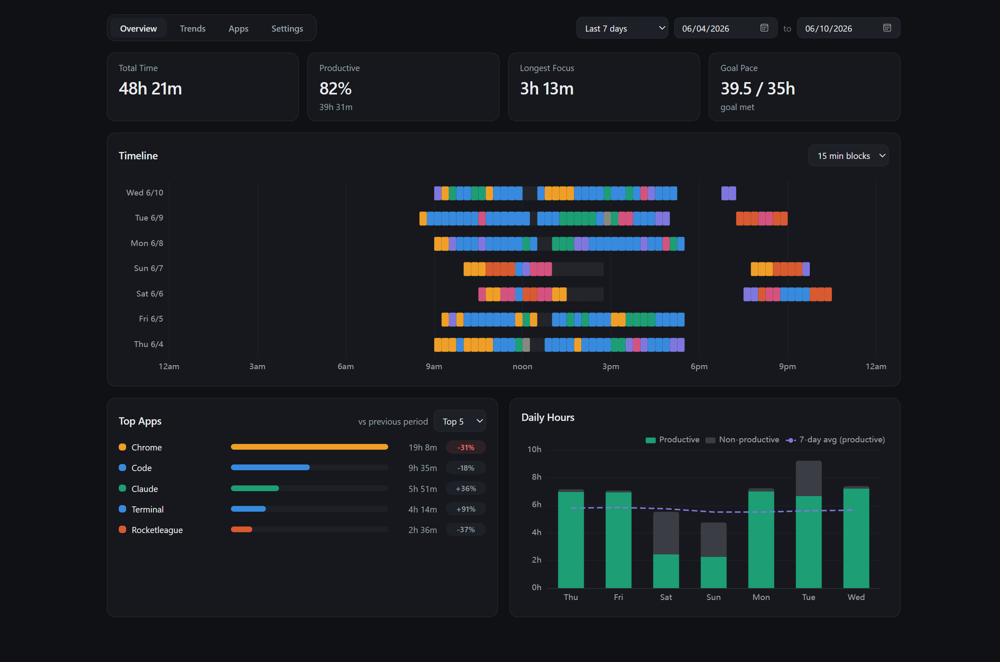

# Time

A personal time tracker for Windows I built to answer one question honestly:
**where do my hours at the computer actually go?**

A lightweight Python tracker runs in the background all day (~20 MB RAM) and
records every stretch of foreground-app focus to SQLite. A Tauri 2 + React
dashboard turns that into answers: how much I worked, what ate the afternoon,
whether this week beat last week.



> All screenshots use a synthetic demo dataset
> ([scripts/make_demo_db.py](scripts/make_demo_db.py)) — plausible fake weeks,
> nobody's real browsing history.

## What it does

- **Tracks sessions, not samples.** Each row in the database is a span of
  real focus on one app/window — when it started, when it ended, what it was.
  Transitions are detected on a 1-second cadence.
- **Knows when you walk away.** No input for 3 minutes marks you AFK,
  *back-dated to the last keystroke* so idle time never inflates the stats.
  Locking the screen is AFK instantly.
- **Sees inside the browser.** Domains are parsed from window titles (via a
  "URL in title" extension), so `youtube.com` and `github.com` stop hiding
  inside one big "Chrome" blob.
- **Categorizes everything, live.** Categories and classification rules
  (by process, domain, or title, with priorities) live in the database and are
  edited from the dashboard. The tracker picks up changes within one
  heartbeat — no restarts, no config files.
- **Flags real changes, not noise.** Week-over-week shifts in app usage are
  colored only when a Welch's t-test on daily usage says the change is
  statistically significant — and whether a shift is *good* or *bad* depends
  on the category it belongs to.

## The dashboard

| Tab | What it shows |
| --- | --- |
| **[Overview](docs/overview.md)** | KPI cards (total, productive %, longest focus chain, goal pace), a per-day timeline of color-coded focus blocks, top apps with significance-tested deltas, and daily productive/non-productive hours. |
| **[Trends](docs/trends.md)** | Weekly hours stacked by category over 12 weeks, and a productive-time heatmap by hour of day × day of week. |
| **[Apps](docs/apps.md)** | Every app and domain in range with time, share, and category — plus full category and rule management. |
| **[Settings](docs/settings.md)** | Goals, AFK threshold, heartbeat, week start, browser processes — all editable in-app — plus live tracker status and one-click backup. |

## Built to not lose data

This replaced an earlier version that polled the foreground window and saved
samples. It worked, but it was an amateur build: lossy, fragile, and blind to
idle time. The rewrite treats the tracker like a small piece of infrastructure:

- **Crash-tolerant by design.** The open session's end time is flushed to
  disk every 15 s, so even a hard crash loses at most that much. SQLite runs
  in WAL mode so the tracker and dashboard share the file safely.
- **A real state machine.** Active ↔ AFK ↔ locked transitions are handled in
  one tested core (`tracker/session_manager.py`) with no platform calls in it
  — the Win32 probing lives behind a narrow interface.
- **Single-instance mutex.** A duplicate launch (Task Scheduler retry, fat
  finger) exits cleanly instead of double-counting.
- **Tested where it counts.** pytest covers the session state machine, DB
  layer, and the legacy-data migration; vitest covers the date logic,
  classifier, and KPI math — including the t-test, pinned against scipy
  reference values.
- **Migration with receipts.** The old sample-based history was collapsed
  into sessions by a re-runnable script that backs up first and verifies
  per-day totals against the source.

## Architecture

```
tracker/      Python, always on: Win32 foreground/idle probe -> session rows
Data/         time_log.db (SQLite, WAL) - the single shared source of truth
dashboard/    Tauri 2 + React + ECharts, launched on demand: reads sessions,
              owns categories/rules/settings
```

The two halves never talk to each other directly — the database is the
contract. Settings written by the dashboard are re-read by the tracker every
heartbeat.

## Running it

Built for my own machine rather than distribution, but everything is
repo-relative:

```powershell
pythonw tracker/tracker.py          # tracker (headless)
cd dashboard; npm run tauri dev     # dashboard (dev)
cd dashboard; npm run tauri build   # dashboard (installable build)

py -m pytest tracker/tests scripts/tests   # python tests
cd dashboard; npx vitest run               # dashboard tests
```

The tracker auto-starts at logon via Windows Task Scheduler (a
`New-ScheduledTaskAction` pointing `pythonw.exe` at `tracker\tracker.py`).
The dashboard's DB path defaults to `Data/time_log.db` in the repo; override
with `VITE_DB_PATH`. To explore the app without real data:

```powershell
py scripts/make_demo_db.py     # writes Data/demo.db, ~12 weeks of fake life
```
