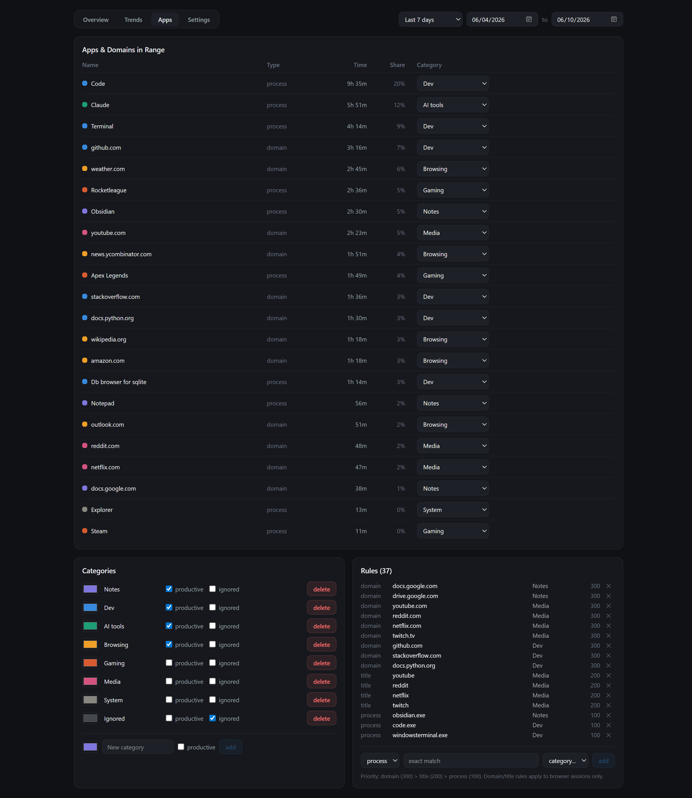

# Apps tab

Where raw tracking becomes meaning: every app and domain, and the rules that
classify them.

## Apps & Domains in Range

Everything seen in the selected range — processes and browser domains in one
list — with time, share of the total, and current category. The dropdown on
each row is a shortcut: pick a category and the matching rule is created on
the spot.

Domains get their own rows because of browser title parsing: with a
"URL in title" extension installed, `github.com` time can be classified as
Dev while `youtube.com` time counts as Media, even though both are part of the Chrome process.

**Renaming apps and domains.** Some executables have unrecognizable names —
`r5apex_dx12.exe` is Apex Legends, `sandfall-win64-shipping.exe` is Expedition 33.
Double-click any row's name to give it a friendly display name; press Enter to
save or Escape to cancel. For a process the rename applies everywhere the app
appears (Insights timeline, top apps, drill-downs); domains are renamable too
(e.g. `gemini.google.com` → Gemini), though they only show on this tab.
Hovering always reveals the real process or domain. Clear the field and save to
revert to the default — for processes that's the auto-cleaned name (a handful of
common cases ship with built-in names that your renames override), for domains
it's the domain itself.

## Categories

Fresh installations offer five editable essentials — **Focus**, **Learning**,
**Communication**, **Entertainment**, and **Utilities** — to make the first
assignments quick. Onboarding can remove the whole starter collection for users
who prefer a blank slate. No applications or sites are assigned automatically.

Categories are colored and flagged productive, neutral, or unproductive — those
flags drive every productive-time metric in the app. The built-in **Ignored**
bucket removes anything assigned to it (launchers, system shell noise) from
every visualization - though it still appears on this tab, labeled "excluded
from stats", so it stays manageable. Each category's swatch opens a color
picker, and double-clicking its name renames it.

## Rules

Classification is rule-based with priorities - lower numbers win:
**domain (1) beats title (2) beats process (3)**. A browser session matching a
domain rule beats a generic process rule for that browser. Rules are evaluated
live in the dashboard, so re-categorizing
retroactively reclassifies all history — nothing is baked in at record time.
