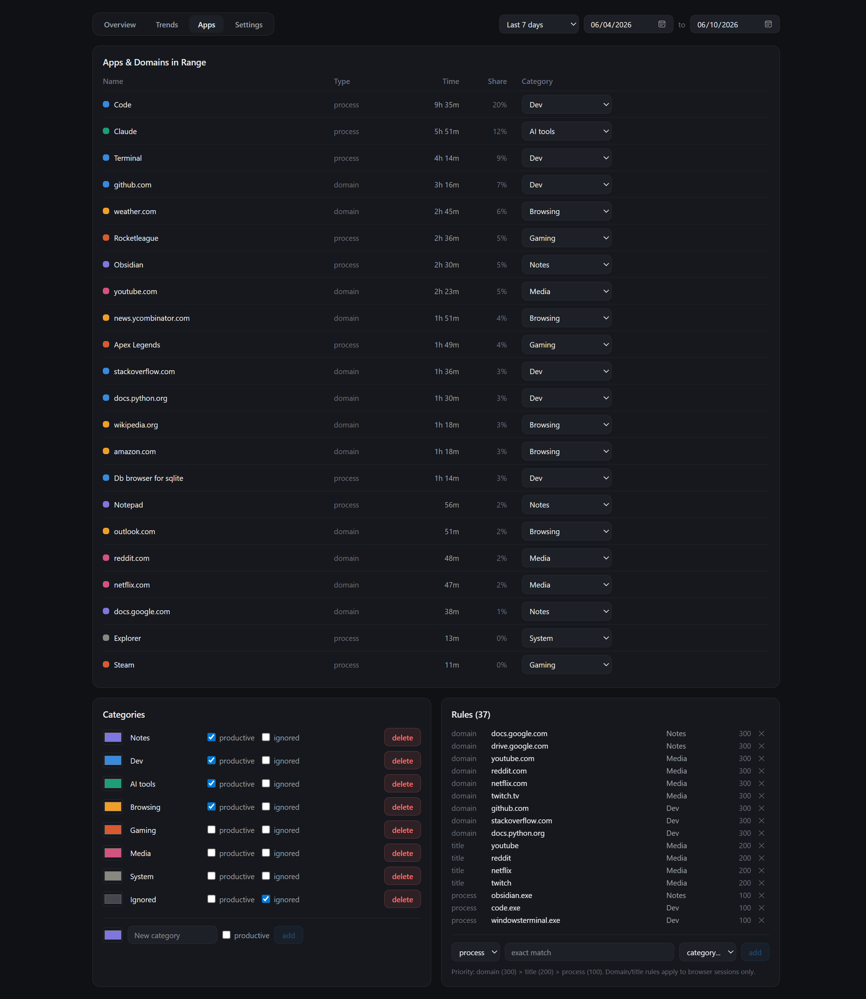

# Activity tab

Activity is the record-management side of Time: review what was recorded,
search it, classify it, correct friendly names, inspect sessions, and delete an
exact scope. Insights remains the analytical side, turning a selected range
into charts, totals, comparisons, and trends.

Activity and Insights share the date picker in the top-right. Switching tabs
does not reset it. Every Activity total and result uses that visible range; a
quiet **Try All time** action appears when a search finds nothing in a narrower
range.

The tab is one card with two faces, chosen from its title: **Apps & Websites**
and **Categories & Rules**. The things you recorded on one side, the labels you
sort them into on the other.

## Apps & Websites

With no search text, this face is a complete catalog of Apps and Websites in
the visible range. It includes ignored activity, excludes AFK identities, and
never uses Insights' minimum-app threshold. Four columns, all sortable:

- **Name** — the friendly name, over a quieter line carrying the item's
  classification, whether it is an App or a Website, and any tags.
- **Time** — recorded time in range, drawn as a bar against the busiest row and
  then stated exactly, the same way Insights lists top apps. The heaviest item
  fills the track and everything else is measured against it; hovering a bar
  reports that item's exact share of all recorded time in the range. The scale
  follows the filters, not the loaded page, so **Load more** never redraws the
  bars above it.
- **Days seen** — how many distinct days the item was used on, which separates
  a daily habit from a single long sitting. A session running past midnight
  counts for both days.
- **Last seen** — the time of day for anything seen today, **Yesterday** for
  the day before, and the date beyond that.

Tags sit beside the name, since each describes the item rather than how it has
been classified. Items first recorded anywhere in your history inside the
visible range are tagged **New**; a range reaching back to your first-ever
session tags nothing, because everything would qualify. **Rare** and
**Utility** mark rows the list normally hides, and appear only while those
rows are being shown.

The table fills the window's remaining height, ending just short of the bottom
of the screen, with its header row pinned and 50 items loaded at a time — so
**Load more** deepens the table's own scroll region instead of stretching the
page, and a taller window simply shows more rows. The count of loaded and total
items sits with **Load more** at the foot of the list, where someone scrolling
is asking for it.

The **Uncategorized** filter carries a count of the items it would show.
Rows the noise filter hides are left out of that count as well as the list, so
the two always agree, and the count follows the Apps/Websites filter for the
same reason.

### Unclassified

Above the table, and only while something is waiting, sits the pending
classification work: the apps and websites that have recorded time but no
category yet. Time in them is left out of every category total in Insights
until they are classified, which is what makes the section worth a minute.

It reads **all history**, not the visible range, and says so beside its
heading — a backlog that emptied when the date picker moved would be a to-do
list nobody could finish. Rows the noise filter hides are left out, so an
installer that ran once cannot hold the list open.

Five rows at a time, longest first, so the section spends itself on the
decisions that move the most time; the rest arrive as those are made. Each row
carries a **Classify** menu listing every category, Ignored ones last. Choosing
one writes a rule for that app or website across all history and from now on —
the same write the item's details make — and the confirmation offers **Undo**.
Past five rows, **Show all** hands the remainder to the table below under the
**Uncategorized** filter over all time.

Clearing the last item takes the section off the page, and the confirmation for
that assignment says everything is classified rather than letting the section
disappear without comment.

The **Activity** tab carries a dot while an hour or more of unclassified time is
waiting. It is deliberately a higher bar than the section's, which shows from a
single item: the section is already on the page you came to, while the dot
reaches across the app to say a different tab wants you. It is a dot and not a
number because the number belongs where you can act on it.

### Hidden rows

A tracker records every foreground window, so the raw catalog carries rows
nobody wants to track. Two tests can hide those from the list:

- **Rare** — across all recorded history, the item is under the time limit
  **and** at or under the session limit. Both halves are required, so a
  15-second app opened twenty times stays in the list, and so does a single
  forty-minute sitting. Because the test uses all history, changing the visible
  date range cannot make a recurring item look rare.
- **Utility** — the name marks it as a machine chore rather than an
  application: installers, updaters, driver and firmware bundles, extracted
  `.tmp` payloads, Windows plumbing, and local files rendered in a browser.
  These are hidden regardless of duration, because an install can run for twenty
  minutes.

This is a view filter over Apps & Websites only. It never changes a total, an
Insights figure, or what an entity contributes to its category, and anything
already carrying a category or rule is never hidden — an explicit decision
outranks the heuristic. The list header reports how many rows are hidden and
shows them on demand, tagged **Rare** or **Utility**; searching reaches past
the filter, so a search for `setup` still finds the installers. Settings ▸
Activity list sets the mode and both limits, or turns filtering off.

### Searching

One search field covers friendly names, cleaned and recorded app names,
websites, and stored window titles. **✕** or Escape clears it and returns the
full catalog. Results come back in two groups, each with its own **Load more**
and a heading that stays pinned while that group is scrolled:

- **Apps and websites** — the catalog itself, narrowed to matching identities.
  It is the same table with the same columns and the same sort, because an
  app and a website are the same kind of row: each already says which it is,
  and the type filter is there to show one kind at a time.
- **Window matches** — one row per distinct window title, with the matched text
  marked, how many times that window was returned to, and the total time those
  visits came to. A long title is windowed so the match stays visible rather
  than being cut off past the column's width, and a leading **…** shows where
  the title was trimmed.

Window matches are grouped rather than listed one session at a time because a
session row is the tracker's storage unit, not a thing anyone means. Around half
of a typical database's rows last under ten seconds and carry a few percent of
its time, so a title search answered row by row returns hundreds of fragments of
the same window. The heading reports both numbers — windows, and the visits
behind them — and expanding a row puts the individual visits back for the cases
that need them, such as correcting one exact sitting. A window with more visits
than the expansion shows says so.

Stored titles are not listed until a search is entered. Historical titles
remain searchable if future title capture is later disabled. Date and
classification filters apply to both groups. The type filter narrows only the
identity group — a stored title belongs to the session rather than to an app or
a website, so narrowing by type would drop the rows a title search is for. The
Window matches heading says **all types** whenever a type filter is set, so the
exception is visible where it applies.

Ticking a window selects every visit it stands for, and the heading's checkbox
takes every window currently loaded — never the unloaded remainder, since a
checkbox should only promise what it can be seen to tick. This selection is
separate from the one in an item's details, so opening an item does not
discard it.

**Rule…** on any window opens a new Window rule built from it, which is covered
under Categories & Rules below.

### Classification status

Classification status describes the activity represented by the current range,
and leads each row's second line:

- **Uncategorized** has no categorized time.
- **Mixed** means the item does not resolve to one category — either some of its
  time is still uncategorized, or it is categorized differently across its
  sessions. Where a dominant category exists the label names it with a trailing
  count instead, as in *Dev +2*; the full split is in its details. The
  **Mixed** classification filter returns both forms, since they are the same
  word on screen.
- A category name alone means all represented time resolves to that category.
- **Ignored** means all represented activity is excluded from Insights.

### Item details

Selecting an App or Website opens its details: friendly and recorded identity,
first and last seen, time, session count, category distribution, uncategorized
time, rules in use, and its windows.

Windows are grouped there exactly as they are in search results — one row per
title, with its visit count and total time — because an item's own list is one
app's worth of the same fragmentation. Opening a row opens that Window's own
details, where its individual visits are.

Each row also has a checkbox, and ticking one enrols every visit that window
stands for. The box beside the **Windows** heading takes the rows currently
loaded — never the unloaded remainder, since a checkbox should only promise
what it can be seen to tick. With anything ticked, the filter and order controls
give way to **Delete selected** and **Classify**, which do to a set of windows
exactly what the same two controls do to a set of visits one level down; the
heading reports how many visits are in scope. Filtering clears the selection,
which is why the two never share the row.

Set an App default or Website category from here; the resulting rule applies to
all matching historical and future activity, not just the range being inspected.
A more-specific Website or Window rule can still leave an App with Mixed
classification.

## Editing one visit

**Edit** on any individual visit opens it on its own. Its **Category** leads,
because setting one visit's category is the routine reason to open it and always
succeeds; the override outranks every rule.

**Adjust recorded times** is folded away beneath it, being a repair for the rare
occasion the clock was wrong rather than a routine edit. An adjusted span may
not overlap another recording, and since the tracker records continuously the
neighbouring visits usually sit flush against it — so in practice a visit can be
shortened but not lengthened. The panel states the free gap on each side before
anything is typed, and the fields are bounded by it. Times use the local timezone
and cannot end in the future. Away time and the visit in progress cannot be
edited at all.

**Reset edits** returns a visit to exactly what was recorded.

A visit that no longer matches what was captured says so at the right of its
row: **Reclassified** where its category was set by hand, and **Time edited**
where its clock was adjusted. A visit that had both reads as Reclassified, that
being the part worth naming; **Edit** shows the whole of it either way.

### Reclassifying several visits at once

A window's visits are listed under a heading per day, and both the heading and
the **Select all** button above tick a group of them: the heading takes the
visits shown beneath it, while the button takes every visit the window stands
for, including any not yet loaded — which is why it says how many.

With anything ticked, **Classify** applies one category to all of them. This
writes the same per-session override that **Edit** writes, one per visit, and no
rule: it changes the visits you picked and nothing else, leaves future activity
alone, and outranks whatever the rules would otherwise say. It is the tool for an
afternoon that went differently from the usual — a site you normally read for
fun but spent Tuesday working in.

The menu's first entry, **Use automatic classification**, removes those
overrides and hands the visits back to the rules. Selecting everything and
choosing it is how a batch is cleared later; **Undo** on the confirmation is how
it is taken back immediately, and it returns every visit to its own previous
category rather than to a single shared one. Recorded times are untouched either
way, so a visit whose clock was adjusted keeps that adjustment. Away time and
the visit in progress cannot be edited and are reported as skipped rather than
failing the batch.

## Exact deletion

Activity can delete checked sessions or one exact App or Website identity in
the visible range. The confirmation previews the session count, duration,
earliest and latest timestamps, protected live rows, and the database snapshot
used for deletion. Identity deletion removes complete session rows that overlap
the range, even when a row begins just outside it.

**Back up first** is optional and explicit. Newly recorded rows after the
preview cannot be swept into the operation, and the newest live session is
protected while the tracker is actively recording. Pause recording and retry
after that session closes if it also needs correction. Targeted deletion never
stops the tracker and keeps categories, rules, aliases, settings, and separate
backup files.

## Excluded from tracking

The last entry in the classification filter, **Excluded from tracking**, lists
the apps and websites Time is not allowed to record at all. An exclusion stops
matching activity from ever reaching the database, so it is stronger than any
category or rule and is not a property of anything recorded.

Add one from an App or Website's details with **Do not track…**, or by name
from this list. Adding can optionally delete the matching history it finds,
after showing the count. Lifting an exclusion resumes tracking from that moment
on; history deleted along with it is not restored. Settings shows only how many
exclusions exist.

## Categories & Rules

The second face of the card manages classification. Its header counts the
categories and rules defined, and adds **N unclassified** whenever the backlog
is not empty — the tab's dot cannot serve this face, since both faces share a
tab and the dot is already on the tab being read. Following it returns to
[Unclassified](#unclassified).

Categories start collapsed;
the chevron opens their rules. Double-click a name to rename it — Enter or
focus-out saves and Escape cancels — and the opened category repeats **Rename**
as a labeled button, which is what keeps renaming reachable from the keyboard.
**Delete category** sits beside it and confirms the rule count it will take
with it. The built-in Ignored category can do neither.

The search above the list matches rule text, rule kinds, scopes, and category
names at once, and opens every category that has a hit — the fastest way to
answer "where did I classify this" without remembering which category it went
into.

The two order menus beside search follow the same pattern as Apps & Websites.
Categories can sort by name or group by productivity. Rules can sort by type, by
name, or by use; the Type view sorts names within each rule kind.

**Use** orders each category's rules by how much of your history they actually
decided, heaviest first, and prints that time on the row — so the rules carrying
the classification lead, and the ones carrying none collect at the bottom beside
their **unused** tags. Like that tag it counts all of history rather than the
visible range, since a rule that classified a hundred hours in one month is not
unused in the next. A rule outranked by a more specific one counts nothing here,
which is the same measure that decides **unused**.

A category is productive, neutral, or unproductive. Ignoring is not one of
these states: the built-in Ignored category is the single ignore mechanism.
A category left flagged ignored by an older release keeps showing that state
until one of the three is chosen for it.

### Combining Website rules

Classifying a site writes an exact Website rule for it, so a long-lived
database collects near-duplicates: nine separate rules under one company, all
saying the same thing. Because a Website rule already covers every subdomain
beneath it — and a more specific rule still beats it — those nine can usually
become one.

When that has happened, a notice at the top of this face offers the swap. It
names the parent, the category the rules agree on, and any sites that have no
rule yet and would start being classified. **Replace** writes the parent rule
and removes the ones it covers, with **Undo** on the confirmation. **Dismiss**
retires that parent for good.

Nothing already recorded changes: the suggestion is only offered when every
affected session classifies the same way afterwards, checked against the real
rule precedence rather than assumed. Sites with no rule are the exception, and
those are listed by name rather than counted, because they are the one thing
the swap does alter. What changes going forward is that new sites under the
parent are classified automatically instead of appearing in
[Unclassified](#unclassified).

The offer is deliberately hard to earn, since a suggestion that is often wrong
is worse than none. It needs at least three rules agreeing on one category, an
hour of recorded time beneath the parent, and a parent that is a real
registrable name — `bbc.co.uk` qualifies, `co.uk` and `github.io` never can. It
is also withheld when the parent would pull in more unruled sites than the
rules that suggested it, which means the parent is broader than anything you
have actually decided.

There is no equivalent for apps. App rules match an exact process name with no
wildcard, so a group of them has no single rule to become.

The pencil on a rule—or a double-click on its row—loads it into the category's
editor below the list, with the same match preview and duplicate protection used
while adding one; **Save** updates historical and future classification, while
**Cancel** leaves the rule untouched and returns the editor to Add mode. Rules
are removed with a quiet ✕ on their row. Each rule's kind is marked by a small
glyph — a monitor for App, a titled frame for Window, a globe for Website —
because color in this app means category identity. A rule nothing has ever
matched is tagged **unused**, which is the one case worth acting on; per-rule
usage in context lives in each item's details, under **Rules in use**. A long
rule list scrolls inside its own category rather than pushing the categories
below it off the screen.

The interface uses plain rule names while keeping the same matching behavior:

| Rule | What it matches |
| --- | --- |
| **Website** | A detected site such as `github.com`; paths and searches are not stored. |
| **Window** | Normalized text in a stored window title. Title capture is optional and off by default. |
| **App** | The foreground executable, such as `code.exe`. |

When several rules match, Website normally wins, then Window, then App. A Window
rule scoped to one website is the exception: it refines that website, so it wins
there. Rules are evaluated against history instead of baked into session rows,
so edits reclassify existing and future activity — which is also why **unused**
is measured against all of history and not the visible range.

Because a new rule reaches backwards as well as forwards, the builder reports
what it would claim before it is saved: how many visits and hours across all
of your history, and how many of those currently classify differently and would
change. A pattern that cannot be used — a website rule with no usable domain in
it — says so there rather than at the point of saving.

### Window rules and where they apply

App and Website rules answer *which program* and *which site*, and the answer is
the same every time. A Window rule is for the case those cannot reach: one
program holding several genuinely different activities, told apart only by what
the window says. One editor covers two unrelated projects, and only its title
separates them.

The **Match** control chooses how the rule reads that title:

| Match | What it means |
| --- | --- |
| **Text fragment** | The same characters anywhere in the normalized title, including inside a longer word. `time` therefore matches `Runtime`. |
| **Word phrase** | The same consecutive whole words. Punctuation and title separators count as word boundaries, so `list notepad` matches `Grocery list — Notepad`, while `time` does not match `Runtime`. |
| **Whole section** | One complete section separated by spaced marks such as ` — `, ` - `, or ` | `. A hyphen inside a word does not split it. |

Suggestions can make a Whole section rule more precise by anchoring it to the
first, last, or an interior section. An interior section exists only in a title
with at least three sections. The saved rule's label states that anchor; existing
anchored rules remain editable even though manual rule composition does not add
a separate Position decision.

General Window rules are strongest outside the browser, for exactly that reason.
Inside one, a Website rule wins over a Window rule scoped to Any app, Browsers,
or one browser app. Those broader Window rules can still catch pages whose site
was not detected, which happens whenever the URL is not readable from the
window title.

A Window rule scoped to one website is different: it can carve that site into
parts. The website boundary keeps the title match from reaching elsewhere, so
this narrower Window rule wins over the Website rule it refines. For example, a
Website rule can classify all of `youtube.com`, while a Window rule scoped to
`youtube.com` classifies only pages whose stored title matches the chosen text.

That ordering preserves the reliable claim. A detected domain is stronger than
arbitrary title text, so a broad Window rule does not displace it. A
website-scoped Window rule keeps that domain requirement and adds a second,
narrower condition.

Because a title says as much about work in an editor as in a browser, every
Window rule carries a **scope** naming where it may match:

- **Any app** — anywhere the selected title match succeeds.
- **Browsers** — only in the browsers listed in Settings, so adding a browser
  later keeps the rule correct.
- **One app** — only in a named executable, such as `obsidian.exe`.
- **Website** — only on a named detected site; this is the scope that lets the
  Window rule refine that site's Website rule.

Scope exists because the same words mean different things in different programs:
*Skill Tree* in an editor is a project, in a browser it could be anything. Two
rules with the same words and different scopes are two different rules, and when
both could match, the narrower scope wins. Only Window rules take a scope — an
App rule already names its executable and a Website rule only fires in browsers.

The quickest way to write one is **Rule…** on any window, in search results or
in an item's details. It fills in the words from the title, defaults the scope to
the app that window belongs to, and suggests the parts of the title worth
matching on, ranked by how much of your history each would reach. Widening the
scope is then a deliberate choice rather than what happens by not choosing. Both
that dialog and the builder under Categories & Rules report the same counts
before anything is saved.

Window rules in older schemas applied only to browsers. On migration, existing ones become
**Any app**, which can reclassify past activity whose titles happen to
contain the same words; setting such a rule back to **Browsers** restores its
former behaviour exactly, since rules are evaluated against history rather than
written into session rows. The tracker backs the database up in its Backups folder before
migrating.
