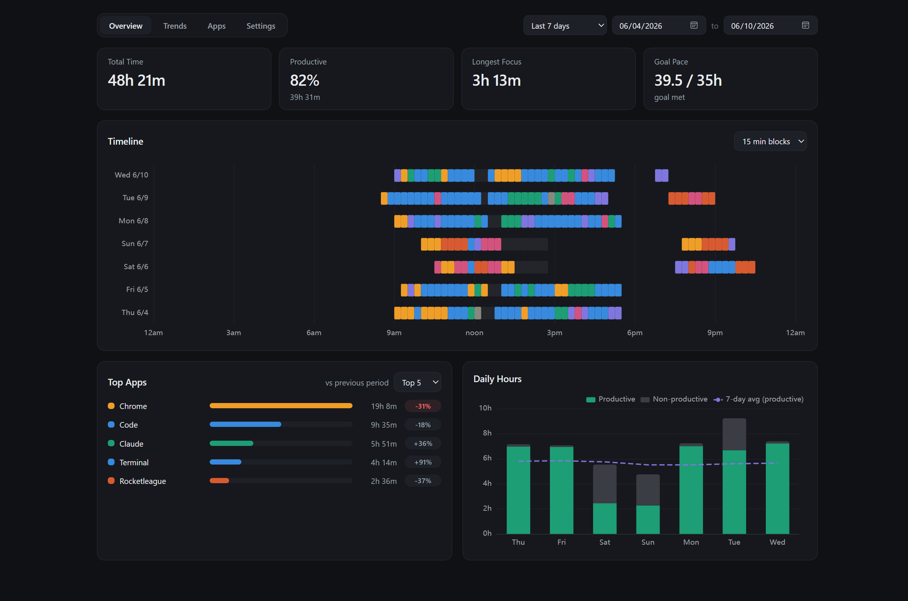

# Insights tab

This tab focuses on your recent behavior. The date picker in the top-right corner offers Today, Last 7/14/28 days, and a custom range.

## KPI cards

| Card | What it measures |
| --- | --- |
| **Average productivity per day** | Productive time in the range divided by its calendar days. |
| **Productivity percent** | Share of non-AFK time spent in categories marked productive. |
| **Longest focus** | The longest unbroken chain of productive sessions. Neutral and uncategorized activity preserve a chain without adding to its duration; unproductive activity or AFK time breaks it. Short untracked gaps up to the "Focus chain max gap" setting are forgiven. |
| **Goal pace** | Productive hours in the range against the weekly goal prorated to the range's length - a trailing measure, deliberately not a catch-up rate. |

## Timeline

Each row is a day; each block is time on one category, color-coded, at a
selectable resolution (5/10/15/30-minute blocks, or exact session segments).
Dim gray blocks are AFK. The shape of a day is instantly readable — morning
browse, two work blocks around lunch, the evening tail.

## Top Apps and Websites

The two menus read together as **Top 10 Apps** or **Top 10 Websites**. Both rank
time in the range and compare it with the previous period of the same length.
Deltas are colored only when the change is big enough to mean something — a
large enough shift, enough minutes behind it, and not the result of one unusual
day — and the color is category-aware: *more* time in a productive app or site
is green, more time in a non-productive one is red, and vice versa for declines.

Websites use exact normalized hostnames: `www.` is already removed, while a
meaningful subdomain such as `docs.google.com` remains distinct from
`mail.google.com`. Only detected website time appears, so the card explains when
browser activity lacks that signal and offers the first-party Time Web Extension
when none can be identified. The minimum-app setting applies only to the Apps
view. Friendly names, search, session review, and exact deletion live in
[Activity](apps.md), while Insights stays focused on analysis.

## Daily Hours

Stacked productive vs non-productive hours per day, with a trailing 7-day
average of productive time to show the trend through the noise.
