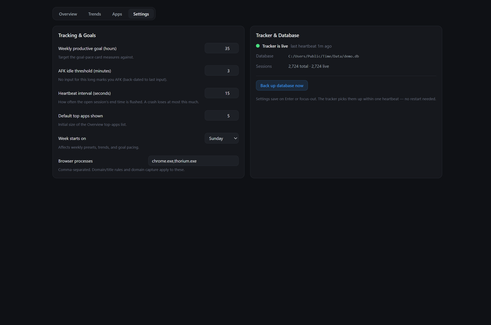

# Settings tab

Every knob lives in the database and is edited here. You do not need to edit config files, or even restart the app after making a change. 

Settings is a single column, read top to bottom: tracker status, what may be
recorded, then the knobs, then the data itself. Adding a setting makes the
column longer and never rearranges it.

## Recording & startup

| Setting | What it controls |
| --- | --- |
| **Record activity** | Allows the tracker to record foreground app names and timing. |
| **Store window titles** | Makes titles searchable and available to Window rules for future activity. Existing titles remain after capture is disabled; App and Website rules still work. Titles may contain sensitive text, so capture is off by default. |
| **Start at Windows sign-in** | Starts the tracker when this Windows account signs in; available only after recording is enabled. |

A summary line reports how many apps and websites are excluded from tracking
outright. The list itself is managed in the [Activity tab](apps.md), under the
**Excluded from tracking** filter, next to the other per-item curation.

## Goals, window, and behavior

| Setting | What it controls |
| --- | --- |
| **Weekly productive goal** | The target the Insights goal-pace card measures against. |
| **Day starts/ends at** | The hour window drawn on the Timeline and Hour-of-Day plots. Activity outside the window still counts in all totals. |
| **Week starts on** | Affects weekly presets, weekly bucketing, and goal pacing. |
| **AFK idle threshold** | How long without input counts as away. The AFK boundary is back-dated to the last real input, so the threshold doesn't leak into the stats. Note this means passively watching video without touching the mouse or keyboard counts as away. |
| **Focus chain max gap** | The longest break between productive sessions that still counts as one focus chain. |
| **Hide list clutter** | Whether the Activity Library hides nothing, rare items, or rare items plus installers, drivers, and local files. Totals and Insights are untouched, categorized items always remain visible, and the Library header can reveal hidden rows. |
| **Rare-item time limit** / **Rare-item session limit** | An item counts as rare only when its all-history time is under the time limit *and* its all-history session count is at or under the session limit. The result does not change with the visible date range. |
| **Minimum app time** | A rate: apps averaging less than this per tracked day are hidden only from Insights' Top Apps. Because it scales with the days that recorded activity, the same apps clear the bar on Today and on Year. Activity always shows the complete catalog. |
| **Heartbeat interval** | How often the open session's end time is flushed to disk; this is the upper bound on data lost in a crash. |
| **Browser processes** | Which apps can be split into Websites and use Website or Window rules. Common browsers ship in the list without `.exe` suffixes. Names with or without the suffix, and pasted install paths, are normalized internally. |

Settings save on Enter or focus-out; the tracker re-reads them within one
second.

## Tracker status

The tracker publishes a dedicated health signal every five seconds, independent
of recorded sessions, exclusions, and the session-flush interval. Settings
reports a missing tracker after the first missed signal plus a short scheduling
allowance, with a distinct paused state when tracking is paused from the tray.

## Restore defaults

**Restore default settings** resets every user-facing setting on this page in
one operation. Recording, title capture, and Windows startup return to off;
goals, timeline, behavior, Activity-list filtering, and Advanced settings return
to their fresh-install values. History, categories, rules, aliases, exclusions,
corrections, backups, and onboarding completion are preserved.

## Data

One card covering the whole life of the database: where it lives, how to save
it, and how to shed it — in that order, ending in the destructive row.

**Back up database now** runs SQLite's
`VACUUM INTO` for a consistent snapshot next to the live file - safe while
both the tracker and dashboard are running. The full path of the backup is
shown on success; restore steps live in [restore.md](restore.md). Both halves'
versions are shown here too, for diagnosing a mismatched install.

Everything Time records stays on your machine; nothing is uploaded. The same
card can delete sessions older than an age cutoff or erase all recorded
history. Exact app, website, window-match, and selected-session correction
lives in the [Activity tab](apps.md), where the scope can be previewed before
deletion.

Deletion uses SQLite secure-delete, checkpoints the WAL, and compacts the
database so removed title text is not left in free pages. Categories, rules,
aliases, and settings are retained. Separately created backup files are never
deleted implicitly. Erase all disables and shuts down the tracker before using
typed confirmation; targeted Activity deletion never stops it and protects the
current live session.
