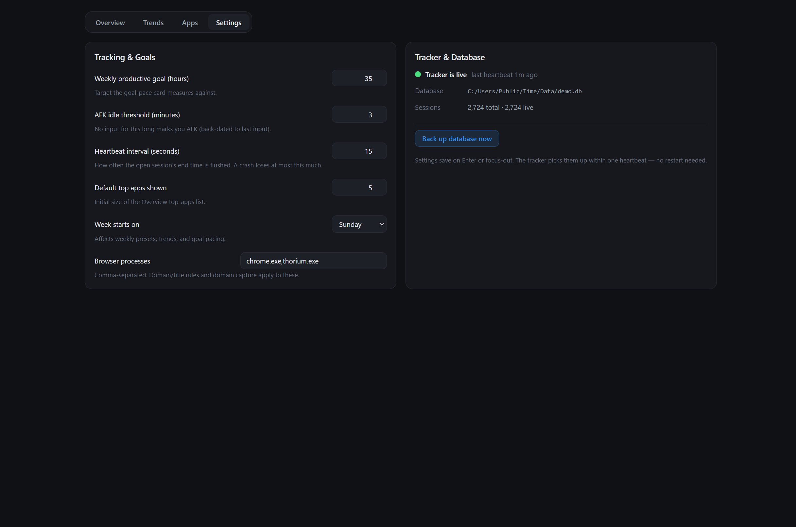

# Settings tab

Every knob lives in the database and is edited here. You do not need to edit config files, or even restart the app after making a change. 

Settings is a single column, read top to bottom: tracker status, what may be
recorded, then the knobs, then the data itself. Adding a setting makes the
column longer and never rearranges it.

## Recording & startup

| Setting | What it controls |
| --- | --- |
| **Record activity** | Allows the tracker to record app names and times |
| **Store window titles** | Stores window titles in the database. This enables window-based classification rules, but stored data may contain sensitive information. |
| **Start at Windows sign-in** | Start the tracker when you sign into this Windows account. |

A summary line reports how many apps and websites are excluded from tracking
outright — a count rather than a list, so the row reads the same at three
exclusions and at three hundred. **View and manage** opens the list itself in
the [Activity tab](apps.md), under the **Excluded from tracking** filter, next
to the other per-item curation.

## Goals, window, and behavior

| Setting | What it controls |
| --- | --- |
| **Weekly productive goal** | The target the Insights goal-pace card measures against. |
| **Day starts/ends at** | The hour window drawn on the Timeline and Hour-of-Day plots. Activity outside the window still counts in all totals. |
| **Week starts on** | Affects weekly presets, bucketing, and goal pacing. |
| **AFK idle threshold** | No input for this long marks you as Away From Keyboard (AFK). AFK time is not classified and does not count towards computer use. |
| **Focus chain max gap** | Bridges untracked gaps up to this long between productive sessions. Neutral and uncategorized activity preserve the chain without adding to its duration; unproductive or AFK time ends it immediately. |
| **Hide system utilities** | Hides uncategorized installers, drivers, and temporary files. |
| **Hide rare items** | Hides uncategorized items only when their all-history time and session count are both below the configured limits. Grouped in Settings with the two limits that define "rare", since neither reads correctly alone. |
| **Rare-item time limit** / **Rare-item session limit** | An item counts as rare only when its all-history time is under the time limit *and* its all-history session count is at or under the session limit. The result does not change with the visible date range. |
| **Minimum app time** | A rate: apps averaging less than this per tracked day are hidden only from Insights' Top Apps. Because it scales with the days that recorded activity, the same apps clear the bar on Today and on Year. Activity always shows the complete catalog. |
| **Heartbeat interval** | How often the open session's end time is flushed to disk; this is the upper bound on data lost in a crash. |
| **Browser processes** | Which apps can be split into Websites and use Website or Window rules. Common browsers ship in the list without `.exe` suffixes. Names with or without the suffix, and pasted install paths, are normalized internally. |

Switches and selectors save immediately; numeric and text fields save on Enter
or focus-out. A small status at the top confirms when writes finish, and a
failed write restores the database value instead of leaving a false selection
on screen. The tracker re-reads its settings within one second.

### What ends a focus chain

A focus chain is an unbroken run of productive time, and the KPI reports the
longest one in the range. Productive sessions add to its duration. Neutral and
uncategorized activity keep an existing chain alive without adding time to it.
An explicitly unproductive session or any AFK stretch ends the chain
immediately.

The max-gap setting bridges short periods with no included session: the tracker
paused or stopped, the machine asleep, or time inside an excluded or ignored
app. A longer untracked gap starts a new chain. The default is five minutes.

The rule is implemented four times over the same session order — `computeKpis`
in `lib/metrics.ts`, the range and per-day passes in `lib/insights.ts`, and the
day and month passes in `lib/overview.ts`. They must stay in agreement.

## Appearance

**Category palette** changes the swatches offered for new categories and the
colors used across charts. Existing categories keep their stored colors. The
preview aligns each palette by perceptual hue so comparable colors occupy
similar positions; this display order does not change category assignment.
**Open Categories & Rules** goes directly to the editor for those existing
colors.

**Productivity colors** switches between the vivid green/red pair and a
blue/red pair designed to remain distinct for common red-green color vision
differences.

## Tracker status

The tracker publishes a dedicated health signal every five seconds, independent
of recorded sessions, exclusions, and the session-flush interval. Settings
reports a missing tracker after the first missed signal plus a short scheduling
allowance, with a distinct paused state when tracking is paused from the tray.

## Restore defaults

**Restore default settings** resets every user-facing setting on this page in
one operation. Recording, title capture, and Windows startup return to off;
goals, timeline, behavior, Activity-list filtering, and Advanced settings return
to their fresh-install values, including Appearance. History, categories, rules,
aliases, exclusions, corrections, backups, and onboarding completion are
preserved.

## Data

One card covering the whole life of the database: where it lives, how to save
it, and how to shed it — in that order, ending in the destructive row.

**Back up now** runs SQLite's `VACUUM INTO` for a consistent snapshot in the
`Backups` subfolder beside the live database. It is safe while both the tracker
and dashboard are running.

**Restore backup** lists Time's manual, pre-update, and pre-restore snapshots
newest first, while **Choose another file** accepts another SQLite backup. Time
validates the selected database, creates a safety snapshot of the current state,
stops the tracker, replaces the database only after the dashboard releases it,
and restarts automatically. Older supported backups are migrated by the tracker
before the dashboard reopens. See [restore.md](restore.md).

Everything Time records stays on your machine; nothing is uploaded. The same
card can delete sessions older than an age cutoff or erase all recorded
history. Exact app, website, window-match, and selected-session correction
lives in the [Activity tab](apps.md), where the scope can be previewed before
deletion.

Tracker support logs live in the neighboring `Logs` folder. They rotate daily
and retain seven rotated files plus the active log; there is no unbounded
dashboard log.

Deletion uses SQLite secure-delete, checkpoints the WAL, and compacts the
database so removed title text is not left in free pages. Categories, rules,
aliases, and settings are retained. Separately created backup files are never
deleted implicitly. Erase all disables and shuts down the tracker before using
typed confirmation; targeted Activity deletion never stops it and protects the
current live session.
