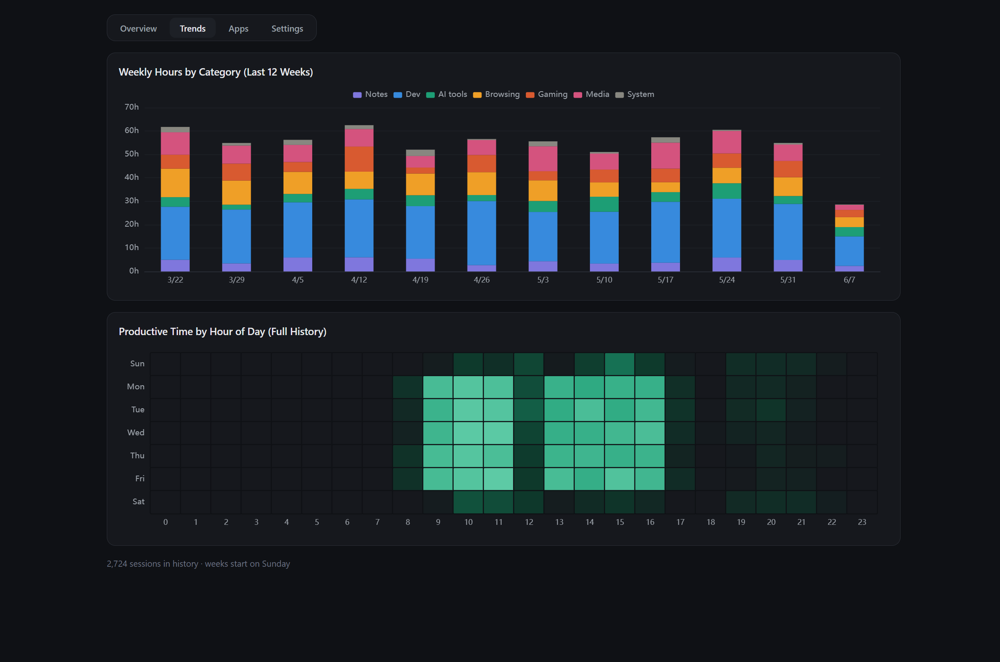

# Trends tab

The long view — no date picker, always the big picture.

## Weekly Hours by Category

The last 12 weeks stacked by category. This is where slow drifts become
visible: gaming creeping up, notes time vanishing, the week a new project
started. Week boundaries respect the "week starts on" setting.

## Productive Time by Hour of Day

A heatmap of productive time across hour-of-day × day-of-week for the entire
history. It answers a question that per-day charts can't: *when* am I
actually good? (For the demo persona: weekday mornings, with a clear lunch
dip — and Saturdays are for not working.)
